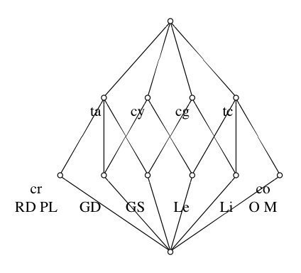

% A Complete Idiot's Guide to Formal Concept Analysis
% Thomas Sutton
% 2013-10-16

# Introduction

Volunteering to give at talk at [FP-Syd][] was supposed to motivate me
to get off my arse and finish a project I started a while ago.

Alas it didn't work and [language-css-attoparsec][] has seen too
little effort to demonstrate:

[FP-Syd]: http://fp-syd.ouroborus.net
[language-css-attoparsec]: https://github.com/thsutton/language-css-attoparsec

I did, however, learn how to use [test-framework][] to run QuickCheck
and HUnit tests.

[test-framework]: http://hackage.haskell.org/package/test-framework

Instead I'll be talking about some Haskell code I wrote to peform
*formal concept analysis*.

# Caveats

- I'm pretty bad at programming in Haskell and the code I'm talking about
is pretty bad code.

- I'm pretty bad at mathematics and the explaination I give here is
probably pretty bad.

If you notice me say something wrong or silly please shout out and let
me know. Or talk to me afterwards.

# Contexts and Concepts

# Basic Algorithm

1. Construct an adjancency matrix of the object/attribute graph. Use a
attribute-major layout as this'll be helpful later on.
   
2. Initialise an table of attributes/objects with a single "all the
things" value. The algorithm will fill this out.

2. While there remain unprocessed attributes in the matrix:

   1. Select the next "maximal" attribute column, removing it from the
   matrix.
   
   2. If the extent of the attribute is already present in the table:
   
         1. Add the attribute we're processing to the existing table
         entry.
      
      otherwise:
      
         1. LOLO
   
# The Code

Using the excellent [cassava][] package for CSV parsing.

[cassava]: http://hackage.haskell.org/package/cassava

# Example

Name               Colour   Type
-----------------  -------  -----
Pink Lady          Red      Apple
Granny Smith       Green    Apple
Golden Delicious   Yellow   Apple
Red Delicious      Red      Apple
Lemon              Yellow   Citrus
Orange             Orange   Citrus
Mandarin           Orange   Citrus
Lime               Green    Citrus

# The Fruit Lattice

